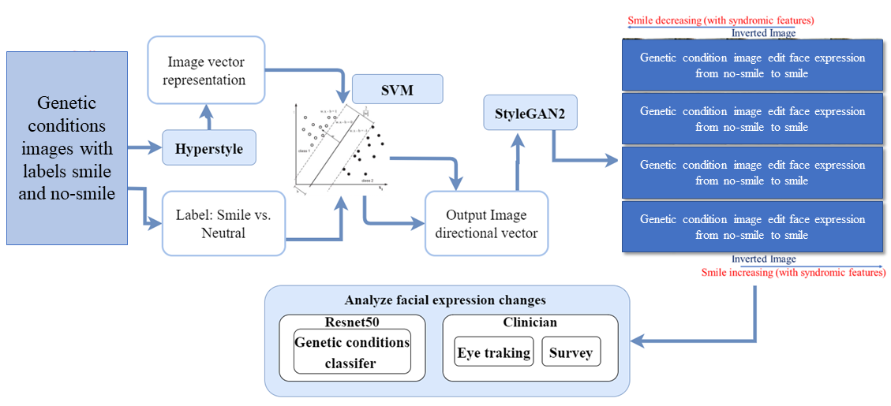
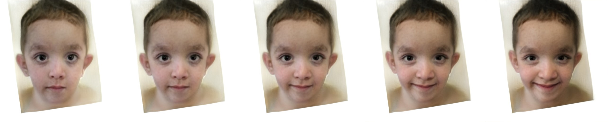

# Approximating facial expression effects on diagnostic accuracy via generative AI in medical genetics
 This repository contains studies of the use of generative AI to analyze genetic disease-related facial expressions. The project focuses on using generative models to analyze and comprehend the distinct facial expressions linked to different genetic conditions through the use of the latest methods.

## Environment
All required Python packages are listed in the ```environment/hyperstyle_env.yaml````file. Create and activate Python environment

```
conda env create --name hyperstyle_env --file environment/hyperstyle_env.yaml
conda activate hyperstyle_env
``` 
Tested in Biowulf using Python 3 in a Conda environment.
## Pretrained HyperStyle Models
In this repository, they provide pretrained HyperStyle models for various domains. We have used human faces.  
All models make use of a modified, pretrained [e4e encoder](https://github.com/omertov/encoder4editing) for obtaining an initial inversion into the W latent space.

Please download the pretrained models from the following links.

| Path | Description
| :--- | :----------
|[Human Faces](https://drive.google.com/file/d/1C3dEIIH1y8w1-zQMCyx7rDF0ndswSXh4/view?usp=sharing)  | HyperStyle trained on the [FFHQ](https://github.com/NVlabs/ffhq-dataset) dataset.

## Auxiliary Models
In addition, they provide various auxiliary models needed for training your own HyperStyle models from scratch.  
These include the pretrained e4e encoders into W, pretrained StyleGAN2 generators, and models used for loss computation.

<br>

### Pretrained W-Encoders
| Path | Description
| :--- | :----------
|[Faces W-Encoder](https://drive.google.com/file/d/1M-hsL3W_cJKs77xM1mwq2e9-J0_m7rHP/view?usp=sharing) | Pretrained e4e encoder trained on FFHQ into the W latent space.

<br>

### StyleGAN2 Generators
| Path | Description
| :--- | :----------
|[FFHQ StyleGAN](https://drive.google.com/file/d/1EM87UquaoQmk17Q8d5kYIAHqu0dkYqdT/view?usp=sharing) | StyleGAN2 model trained on FFHQ with 1024x1024 output resolution.

Note: all StyleGAN models are converted from the official TensorFlow models to PyTorch using the conversion script from [rosinality](https://github.com/rosinality/stylegan2-pytorch).

<br>

### Other Utility Models
| Path | Description
| :--- | :----------
|[IR-SE50 Model](https://drive.google.com/file/d/1KW7bjndL3QG3sxBbZxreGHigcCCpsDgn/view?usp=sharing) | Pretrained IR-SE50 model taken from [TreB1eN](https://github.com/TreB1eN/InsightFace_Pytorch) for use in our ID loss and encoder backbone on human facial domain.
|[ResNet-34 Model](https://download.pytorch.org/models/resnet34-333f7ec4.pth) | ResNet-34 model trained on ImageNet taken from [torchvision](https://github.com/pytorch/vision/blob/master/torchvision/models/resnet.py) for initializing our encoder backbone.
|[MoCov2 Model](https://drive.google.com/file/d/18rLcNGdteX5LwT7sv_F7HWr12HpVEzVe/view) | Pretrained ResNet-50 model trained using MOCOv2 for computing MoCo-based loss on non-facial domains. The model is taken from the [official implementation](https://github.com/facebookresearch/moco).
|[CurricularFace Backbone](https://drive.google.com/file/d/1f4IwVa2-Bn9vWLwB-bUwm53U_MlvinAj/view?usp=sharing) | Pretrained CurricularFace model taken from [HuangYG123](https://github.com/HuangYG123/CurricularFace) for use in ID similarity metric computation.
|[MTCNN](https://drive.google.com/file/d/1tJ7ih-wbCO6zc3JhI_1ZGjmwXKKaPlja/view?usp=sharing) | Weights for MTCNN model taken from [TreB1eN](https://github.com/TreB1eN/InsightFace_Pytorch) for use in ID similarity metric computation. (Unpack the tar.gz to extract the 3 model weights.)

By default, we assume that all auxiliary models are downloaded and saved to the directory `pretrained_models`. 
However, you may use your own paths by changing the necessary values in `configs/path_configs.py`. 

<br>
<br>

# Training
## Preparing your Data
In order to train HyperStyle on your own data, you should perform the following steps: 
1. Update `configs/paths_config.py` with the necessary data paths and model paths for training and inference.
```
dataset_paths = {
    'train_data': '/path/to/train/data'
    'test_data': '/path/to/test/data',
}
```
2. Configure a new dataset under the `DATASETS` variable defined in `configs/data_configs.py`. There, you should define the source/target data paths for the train and test sets as well as the transforms to be used for training and inference.
```
DATASETS = {
	'my_hypernet': {
		'transforms': transforms_config.EncodeTransforms,   # can define a custom transform, if desired
		'train_source_root': dataset_paths['train_data'],
		'train_target_root': dataset_paths['train_data'],
		'test_source_root': dataset_paths['test_data'],
		'test_target_root': dataset_paths['test_data'],
	}
}
```
3. To train with your newly defined dataset, simply use the flag `--dataset_type my_hypernet`.

<br>

## Preparing your Generator
In this work, we use rosinality's [StyleGAN2 implementation](https://github.com/rosinality/stylegan2-pytorch). 
If you wish to use your own generator trained using NVIDIA's implementation there are a few options we recommend:
1. Using NVIDIA's StyleGAN2 / StyleGAN-ADA TensorFlow implementation.  
   You can then convert the TensorFlow `.pkl` checkpoints to the supported format using the conversion script found in [rosinality's implementation](https://github.com/rosinality/stylegan2-pytorch#convert-weight-from-official-checkpoints).
2. Using NVIDIA's StyleGAN-ADA PyTorch implementation.  
   You can then convert the PyTorch `.pkl` checkpoints to the supported format using the conversion script created by [Justin Pinkney](https://github.com/justinpinkney) found in [dvschultz's fork](https://github.com/dvschultz/stylegan2-ada-pytorch/blob/main/SG2_ADA_PT_to_Rosinality.ipynb).  

Once you have the converted `.pt` files, you should be ready to use them in this repository.  

<br>

## Training HyperStyle with genetic conditions faces
The main training script can be found in `scripts/train.py`.  
Intermediate training results are saved to `opts.exp_dir`. This includes checkpoints, train outputs, and test outputs.  
Additionally, if you have tensorboard installed, you can visualize tensorboard logs in `opts.exp_dir/logs`. 

Specifically, we first randomly partitioned the 70,000 FFHQ images into 59,600 and 10,400 for training and validation, respectively. Next, we added our 3,516 syndromic images into the training set. This yields a final training dataset of size 63,116 (from 59,600 and 3,516) which enabled us to reliably train HyperStyle. 

Training HyperStyle with the settings used in the paper can be done by running the following command. Here, we provide an example for training on the genetic condition human faces domain:

```
python scripts/train.py \
 --dataset_type=genetic_dataset_encode \
 --encoder_type=SharedWeightsHyperNetResNet \
 --exp_dir=/data/patelt6/hyperstyle/experiments/hyperstyle_finetune/ \
 --workers=8 \
 --batch_size=8 \
 --test_batch_size=8 \
 --test_workers=8 \
 --val_interval=5000 \
 --save_interval=10000 \
 --lpips_lambda=0.8 \
 --l2_lambda=1 \
 --id_lambda=0.1 \
 --n_iters_per_batch=5 \
 --max_val_batches=150 \
 --output_size=1024 \
 --load_w_encoder \
 --checkpoint_path pretrained_models/hyperstyle_ffhq.pt \
 --w_encoder_checkpoint_path pretrained_models/faces_w_encoder.pt \ 
 --layers_to_tune=0,2,3,5,6,8,9,11,12,14,15,17,18,20,21,23,24
```
  

### Additional Notes
- To select which generator layers to tune with the hypernetwork, you can use the `--layers_to_tune` flag.
    - By default, we will alter all non-toRGB convolutional layers. 
- ID/similarity losses: 
    - For the human facial domain we use a specialized ID loss based on a pretrained ArcFace network. This is set using the flag `--id_lambda=0.1`.
    - For all other domains, please set `--id_lambda=0` and `--moco_lambda=0.5` to use the MoCo-based similarity loss from Tov et al. 
        - Note, you __cannot__ set both `id_lambda` and `moco_lambda` to be active simultaneously.
- You should also adjust the `--output_size` and `--stylegan_weights` flags according to your StyleGAN generator. 
- To use the HyperStyle with Refinement Blocks based on separable convolutions (see the ablation study), you can set the `encoder_type` to `SharedWeightsHyperNetResNetSeparable`.
- See `options/train_options.py` for all training-specific flags. 

<br> 

### Pre-Extracting Initial Inversions
To provide a small speed-up and slightly reduce memory consumption, we could pre-extract all the latents and inversions from our W-encoder rather than inverting on the fly during training.   
We provide an example for how to do this in `configs/data_configs.py` under the `ffhq_hypernet_pre_extract` dataset.  
Here, we must define: 
- `train_source_root`: the directory holding all the initial inversions
- `train_target_root`: the directory holding all target images (i.e., original images)
- `train_latents_path`: the `.npy` file holding the latents for the inversions 
    of the form  
    ```latents = { "0.jpg": latent, "1.jpg": latent, ... }```.

And similarly for the test dataset.  

Performing the above and pre-extracting the latents and inversions could also allow you to train HyperStyle using latents from various encoders such as pSp, e4e, and ReStyle into W+ rather than using our pretrained encoder into W.

During training, we will use the `LatentsImagesDataset` for loading the inversion, latent code, and target image.

<br>

## Inference Script
You can use `scripts/inference.py` to apply a trained HyperStyle model on a set of images:
```
python scripts/inference.py \
 --exp_dir=hyperstyle/experiments/inverted_KS_unaffected_1024pix/
 --checkpoint_path=hyperstyle/experiments/hyperstyle_train_on_1024pix/checkpoints/GeneticConditionsFaces.pt \
 --data_path=hyperstyle/experiments/GeneticConditionsFaces/ \
 --test_batch_size=4 --test_workers=4 --n_iters_per_batch=5 --load_w_encoder \
 --w_encoder_checkpoint_path /hyperstyle/pretrained_models/faces_w_encoder.pt

```
This script will save each step's outputs in a separate sub-directory (e.g., the outputs of step `i` will be saved in `/path/to/experiment/inference_results/i`). In addition, 
side-by-side reconstruction results will be saved to `/path/to/experiment/inference_coupled`.

Notes: 
- By default, the images will be saved at their original output resolutions (e.g., `1024x1024` for faces, `512x384` for cars).
    - If you wish to save outputs resized to resolutions of `256x256` (or `256x192` for cars), you can do so by adding the flag `--resize_outputs`.
- This script will also save all the latents as an `.npy` file in a dictionary format as follows: 
    - ```latents = { "0.jpg": latent, "1.jpg": latent, ... }```
      
<br>

### Editing Faces with InterFaceGAN
```
python editing/inference_face_editing.py \
 --exp_dir=hyperstyle/experiments/GeneticConditionsFaces/ExpressionChanges/ \
 --checkpoint_path=hyperstyle/experiments/hyperstyle_train_on_1024pix/checkpoints/GeneticConditionsFaces.pt \
 --data_path=hyperstyle/experiments/GeneticConditionsFaces/  \
 --test_batch_size=4 \
 --test_workers=4 \
 --n_iters_per_batch=3 \
 --edit_directions=GeneticConditionsSmile\
 --factor_range=4 \
 --load_w_encoder
```
For InterFaceGAN they currently support edits of age, pose, and smile. 
We have use InterFaceGAN to generate smile boundry for genetic conditions. 

<br>

### Search Semantic Boundary using interfacegan

```bash
python train_boundary.py \
    -o interfacegan/boundaries/WS/ \
    -c hyperstyle/experiments/directions/latents.npy \
    -s hyperstyle/experiments/directions/expression_score.npy
```
<br>

## Editing Faces with HyperStyle with interfacegan (SVM) direction for Noonan syndrome
To save the hyperstyle Genetic conditions models [HyperStyle pretrained Genetic conditions model](https://drive.google.com/file/d/1ipEk5iPDq6PLo2zNCrtmwW1wlcE78Atz/view?usp=drive_link)
```
python editing/inference_face_editing.py \
 --exp_dir="Expected path to save the stripes" \
 --checkpoint_path="load the saved model 'HyperStyle pretrained Genetic conditions model'" \
 --data_path="load the Noonan syndrome original images folder path"  \
 --test_batch_size=4 \
 --test_workers=4 \
 --n_iters_per_batch=3 \
 --edit_directions=ns_smile\
 --factor_range=4 \
 --load_w_encoder
```
For InterFaceGAN they currently support edits of age, pose, and smile. 
We utilized InterFaceGAN (SVM) to search sematic boundry to produce smile boundaries for various genetic conditions featured in our main paper, such as Angelman Syndrome (AS), Noonan Syndrome (NS), Williams Syndrome (WS), and 22q11 deletion syndrome (22q). Specifically, we demonstrated the generation of Noonan syndrome patterns with altered expressions reflecting syndromic characteristics. Employing the provided script alongside our pre-trained models and parameters, we achieved successful generation of these patterns. Moreover, you can access the python notebook [https://github.com/pateltanvi2992/Analyzing-Facial-Expressions-with-Generative-AI-in-Clinical-Genetics/blob/main/GenAI_Genetics_notebook.ipynb] from this link to generate the stripes for genetic conditions to alter facial expressions. 
 

<br>

# Credits
**StyleGAN2 model and implementation:**  
https://github.com/rosinality/stylegan2-pytorch  
Copyright (c) 2019 Kim Seonghyeon  
License (MIT) https://github.com/rosinality/stylegan2-pytorch/blob/master/LICENSE  

**IR-SE50 model and implementations:**  
https://github.com/TreB1eN/InsightFace_Pytorch  
Copyright (c) 2018 TreB1eN  
License (MIT) https://github.com/TreB1eN/InsightFace_Pytorch/blob/master/LICENSE  

**LPIPS model and implementation:**  
https://github.com/S-aiueo32/lpips-pytorch  
Copyright (c) 2020, Sou Uchida  
License (BSD 2-Clause) https://github.com/S-aiueo32/lpips-pytorch/blob/master/LICENSE  

**pSp model and implementation:**   
https://github.com/eladrich/pixel2style2pixel  
Copyright (c) 2020 Elad Richardson, Yuval Alaluf  
License (MIT) https://github.com/eladrich/pixel2style2pixel/blob/master/LICENSE

**hyperstyle model and implementation:**   
https://github.com/omertov/encoder4editing
Copyright (c) 2021 Yuval Alaluf, Omer Tov  
License (MIT) https://github.com/yuval-alaluf/hyperstyle/blob/main/LICENSE

**interfacegan model and implementation:**  
https://github.com/genforce/interfacegan
Copyright (c) 2019 Yujun Shen
License (MIT) https://github.com/genforce/interfacegan/blob/master/LICENSE


